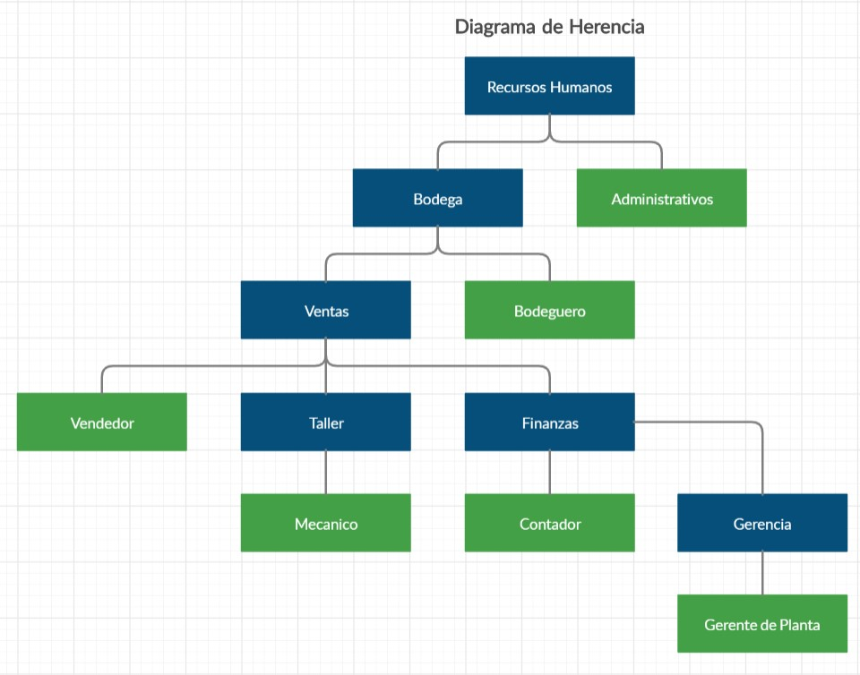
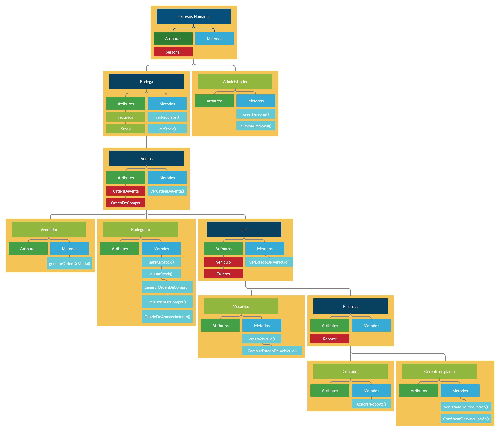

#  Laboratorio de JAVA 

## **Terminos de uso y condiciones.**
*   No me copien la wea bastardos culiaos, ya chao.
*   Este trabajo se respalda al uso exclusivo de **Javier Almarza**.
*   Quiero dejar en claro que **Javascript > JAVA** en todos los aspectos.
*   Sigo sin entender para que quieren un Makefile o un ScripShell.
*   Esta es mi bitacora escrita en MarkDown, **saludos**.

## **Trabajando para usted**

***
## **Areas De Trabajo.**
    Las areas de trabajo son aquellas clases que heredan sus atributos y metodos a las clases hijas, al menos eso se espera.

*   Ventas.
*   Recursos humanos.
*   Taller.
*   Finanzas.
*   Gerencia.
*   Bodega.

## **Clase de Trabajadores.**
    Cada Trabajador tiene sus Atributos y propiedades privadas para controlar el acceso a ciertos datos.

*   Vendedor.
*   Administrador.
*   Contador.
*   Bodeguero.
*   Mecanico.
*   Gerente de planta.

## **Assets, Objetos complejos para datos.**
    Los Assets funcionan como intermediarios de datos más complejos entre clases.

*   Personal.
*   OrdenDeCompra.
*   OrdenDeVentas.
*   Reporte.
*   Taller.
*   Vehiculo.

***
## **Diagrama de Herencia**

Versión: 1.0.0

## **Diagrama de Objetos, Herencia, Metodos y Atributos**

Versión: 1.1.0

***
